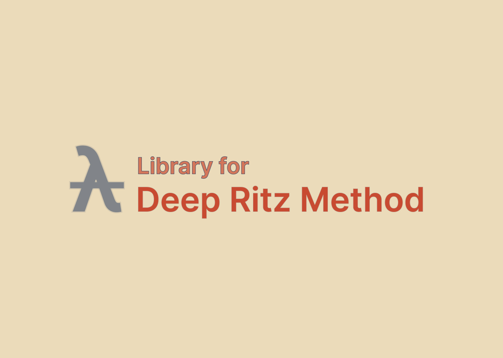

<h1 align="center">Deep Ritz PDE Solver: Deep Ritz Method for Partial Differetial Equations</h1>
    🪐 A project for solving Partial Differential Equations with Deep Neural Network!
<p align="center">

</p>


<!-- ABOUT THE PROJECT -->

## About The Project

This project is mainly inspired by Deep Ritz Method proposed by E Weinan, et al. And some codes are adopted from 

https://github.com/ZeyuJia/DeepRitzMethod


<p align="right">(<a href="#top">back to top</a>)</p>

<!-- GETTING STARTED -->

## Getting Started

How to use this project?

### Prerequisites

- Clone the whole repo from GitHub

    ```bash
    git clone https://github.com/JiantingFeng/DRM-PDE.git && cd ./DRM-PDE
    ```

    

* Install Python and related packages
  ```sh
  conda install --file requirements.txt
  ```

<!-- USAGE EXAMPLES -->
## Usage

You should know a little bit about Finite Element Method or Functional Analysis for using this project. The basic procedure is following:

#### Reorganize the Equation

$$
\begin{equation}
		\begin{split}
			-\sum_{i, k}\partial_i(a_{ik}\partial_ku)+a_0u &= f\quad x\in\Omega,\\
			u &= 0\quad x\in\partial\Omega
		\end{split}
	\end{equation}
$$

the corresponding functional optimization problem is

$$
		J[v]=\int_\Omega\Big[\frac{1}{2}\sum_{i,k}a_{ik}\partial_iv\partial_kv +\frac{1}{2}a_0v^2-fv\Big]dx
$$

and the solution satisfies

$$
		u = \arg\min_{v\in H} J[v]
$$

Here, $H$ is DNN functional space

#### Insert Boundary Condition

For a typical machine learning algorithm, loss function is essential, here, we use

$$
	\begin{split}
		l(u) &= J[u] + \beta \int_{\partial\Omega}|u-u_{\text{bnd}}|^2\textrm dx\\
		&= \int_\Omega\Big(\frac{1}{2}\sum_{i,k}a_{i,k}\partial_i u\partial_j u +\frac{1}{2}a_0u^2-fu\Big)\textrm dx + \beta \int_{\partial\Omega}|u-u_{\text{bnd}}|^2\textrm ds
	\end{split}
$$

as our loss function

#### Define the architecture of DNN

We use basic ResNet-like architecture to avoid gradient vanishing, with GELU activation.

In dimension is as same as $\dim \Omega$, out dimension is set as $1$ (For real-valued equations). 

#### Training

Randomly sample points inside $\Omega$ and $\partial \Omega$, pass through the NN, and get the output and loss value, use Adam or SGD to take gradient descent.

<p align="right">(<a href="#top">back to top</a>)</p>


<!-- CONTRIBUTING -->
## Contributing

No further maintenance for this project, you can just fort this project and make changes without contacting me.

<p align="right">(<a href="#top">back to top</a>)</p>


<!-- CONTACT -->
## Contact
<span>
Jianting Feng -  gianting01@gmail.com
</span>
<span>
Homepage - [https://jiantingfeng.vip](https://jiantingfeng.vip)
</span>
<span>
Project Link - [https://github.com/JiantingFeng/
Deep-Ritz-PDE-Solver](https://github.com/JiantingFeng/
Deep-Ritz-PDE-Solver)
</span>
<p align="right">(<a href="#top">back to top</a>)</p>
